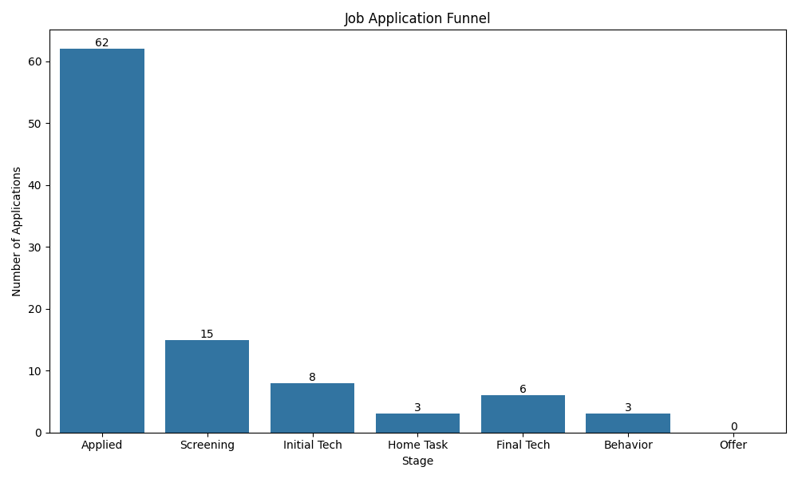
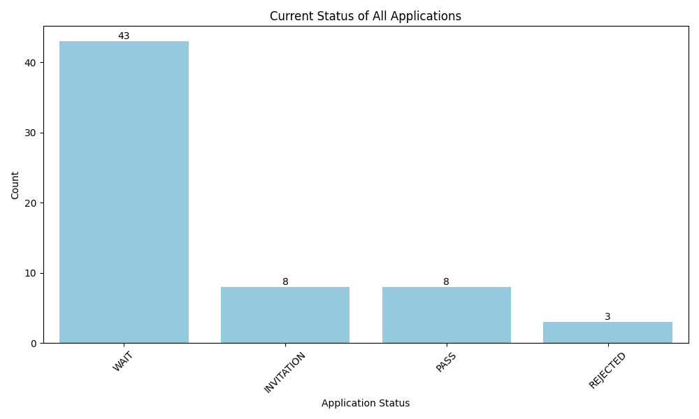
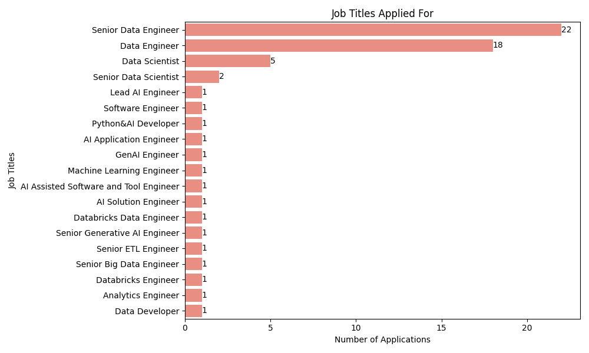
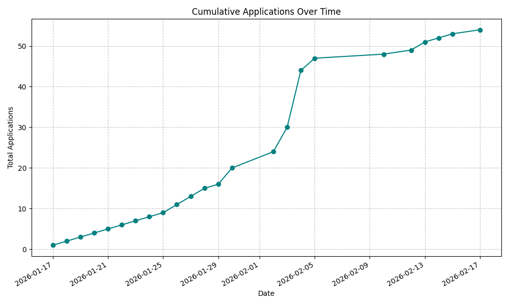
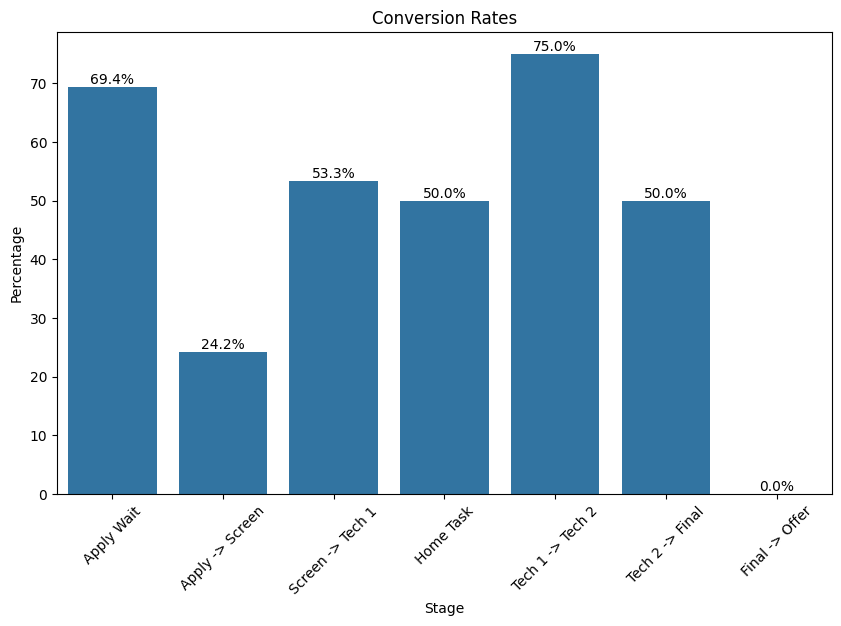
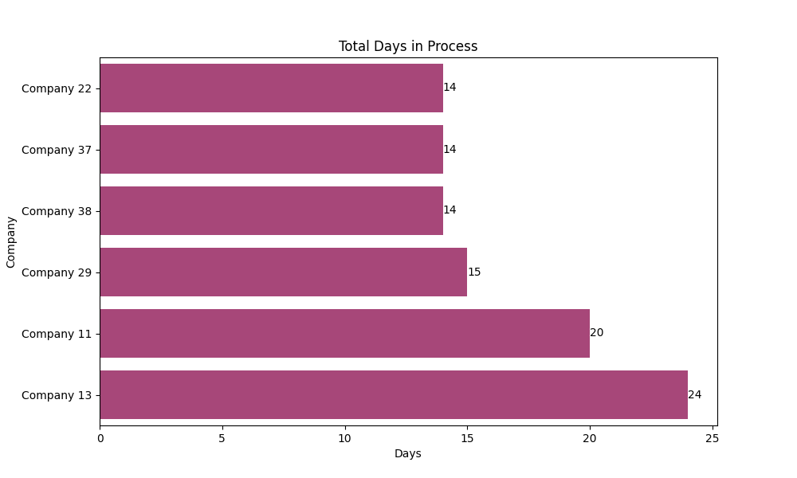
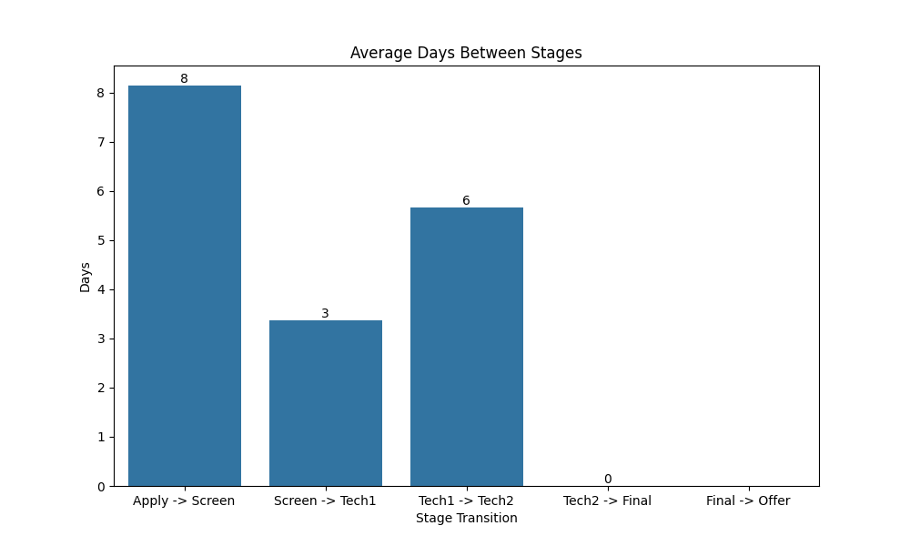
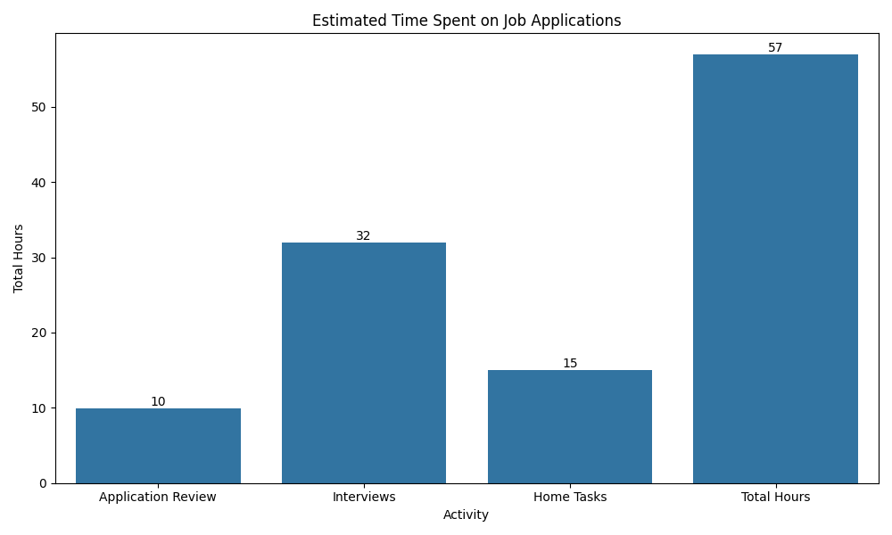
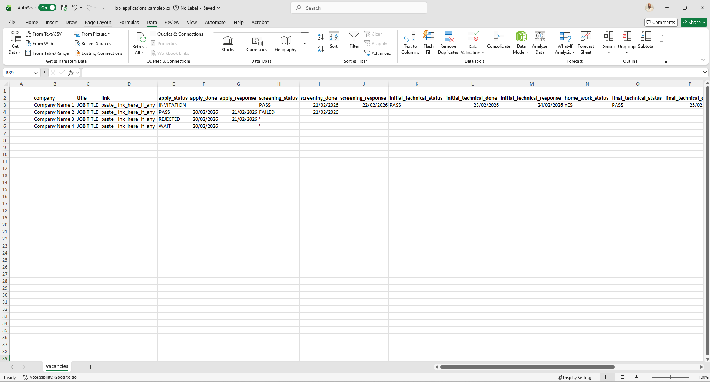

# Job App
Personal job application tracker and analytics.


## Results
Analyze the job application process by accessing [Job Application](./job_app.ipynb) file.

1. Job Application Funnel



2. Application Status



3. Job Titles



4. Cumulative Application



5. Conversion Rates



6. Cycle Time



7. Stage Duration



8. Time Spent




## Tracking

### Store file
Use the [job_applications_sample.xlsx](./job_applications_sample.xlsx) file as a template and rename it to `job_applications.xlsx`.\


### Fields definition
| Column | Name | Type | Description | Example |
| --- | --- | --- | --- | --- |
| b | company | Text | enter plain company name | Google |
| c | title | Text | enter plain job title | Data Engineer |
| d | link | HyperLink | enter the job link | www.example.com/careers/data-engineer |
| e | apply_status | Option[Text] | choose an option from the list for the application | [INVITATION, WAIT, PASS, REJECTED] |
| f | apply_done | Date | enter the date when applied | 20-02-2026 |
| g | apply_response | Date | enter the date when got response on application | 20-02-2026 |
| h | screening_status | Option[Text] | choose an option from the list for the screening | ['', WAIT, PASS, FAILED] |
| i | screening_done | Date | enter the date when screened | 20-02-2026 |
| j | screening_response | Date | enter the date when got response on screening | 20-02-2026 |
| k | initial_technical_status | Option[Text] | choose an option from the list for the initial technical interview | ['', WAIT, PASS, FAILED] |
| l | initial_technical_done | Date | enter the date when initial technical interview scheduled | 20-02-2026 |
| m | initial_technical_response | Date | enter the date when got response on initial technical interview | 20-02-2026 |
| n | home_work_status | Option[Text] | choose an option from the list for the home task | ['', YES, NO] |
| o | final_technical_status | Option[Text] | choose an option from the list for the final technical interview | ['', WAIT, PASS, FAILED] |
| p | final_technical_done | Date | enter the date when final technical interview scheduled | 20-02-2026 |
| q | final_technical_response | Date | enter the date when got response on final technical interview | 20-02-2026 |
| r | behavior_status | Option[Text] | choose an option from the list for the behavior interview | ['', WAIT, PASS, FAILED] |
| s | behavior_done | Date | enter the date when behavior interview scheduled | 20-02-2026 |
| t | behavior_response | Date | enter the date when got response on behavior interview | 20-02-2026 |
| u | offer_status | Option[Text] | choose an option from the list for the offer | ['', WAIT, ACCEPTED, REJECTED] |
| v | offer_done | Date | enter the date when offer received | 20-02-2026 |
| w | offer_response | Date | enter the date when sent response on offer | 20-02-2026 |


### Update record
Update every job application once navigate through the process.


## Analysis

### Cloud
1. Access [Google Colab](https://colab.research.google.com/).

2. Authenticate with the Google account.

3. Create a new notebook and rename it.

3. Upload the `job_application.xlsx` file.

4. Copy the content of the `job_app.ipynb` file to the new created notebook.

5. Run the notebook.

6. Analyze the analytics for the job application process.


### Local
1. Install Python following [Python Isnstall](https://www.python.org/downloads/) instructions.

2. *Optional*: Install VS Code following [VS Code Install](https://code.visualstudio.com/download) instructions.

3. Create a virtual environment using the command below in the terminal.
- For **MacOS**:
```
python3 -m venv venv
source venv/bin/activate
```
- For **Windows**:
```
python -m venv venv
venv/Scripts/activate
```

4. Install necessary dependencies.
```
pip install -r requirements.txt
```

5. Copy the `job_application.xlsx` file to the root of the project.

6. Open `job_app.ipynb` file and press *Run All* button.

7. Analyze the analytics for the job application process.